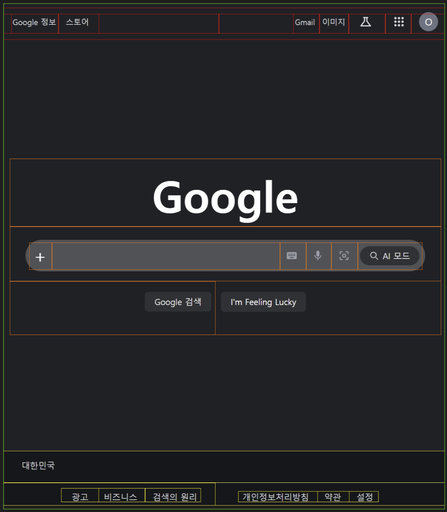

## 섹션 구분

- 구글 메인 화면 섹션 구조 분석
직접 작성하신 구글 메인 화면의 구조는 크게 Header(상단 네비게이션), MainContent(중앙 검색 영역), Footer(하단 정보 영역) 3개의 섹션으로 이루어져 있습니다.

- Header (상단바) 부분은 양끝으로 나뉜 두 개의 영역으로 구성됩니다. 좌측은 'Google 정보'와 '스토어' 텍스트 링크가 있고, 우측은 'Gmail', '이미지' 링크와 함께 실험실, 구글 앱스(그리드), 프로필 아이콘이 나란히 배치되어 있습니다.

- MainContent (중앙 컨텐츠) 부분은 화면 한가운데에 세로로 쌓인 3개의 요소로 구성됩니다. 가장 위에는 거대한 글씨의 Google 로고가 있고, 그 아래에는 검색창(내부에 +, 가상 키보드, 마이크, 구글 렌즈, AI 모드 아이콘 포함)이 위치하며, 가장 아래에는 검색 버튼 두 개(Google 검색, I'm Feeling Lucky)가 나란히 놓여 있습니다.

- Footer (하단바) 부분은 화면 맨 아래에 착 붙어 있으며 위아래 두 줄로 구성됩니다. 첫 번째 줄은 국가 정보(대한민국)를 표시하는 섹션이고, 두 번째 줄은 좌측(광고, 비즈니스 등)과 우측(개인정보처리방침, 설정 등)으로 양분된 부가 정보 텍스트 링크 섹션입니다.

## 신경써서 구현한 부분
-> 구글 사이트에 보면 Ai모드라는 버튼이 있는데 해당 버튼 위에 마우스 커서를 올리면 border가 무지개색으로 빛나면서 커서를 따라가게 됩니다. 해당 부분이 너무 신기해서 여러가지 검색을 해보다가 해당 버튼을 구현하기 위해서는 3개의 layer를 겹쳐서 만든다는 것을 알았습니다.
## 질문
<!-- 개인적으로 물어보셔도 됩니다! -->